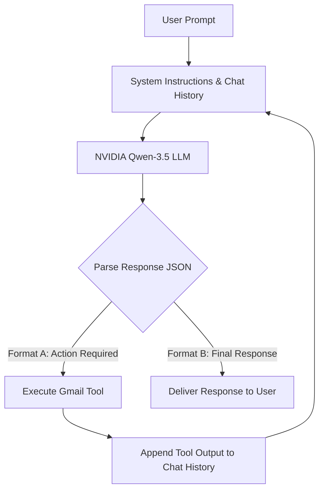

# Simple AI Email Agent

An autonomous, multi-user AI Email Automation Agent powered by the Qwen-3.5 model (via the NVIDIA API) and integrated with the Google Gmail API. The agent uses a ReAct (Reasoning and Action) loop to understand user requests, execute tools to read/write emails, and provide final natural language responses.

---

## How It's Made (Architecture & Mechanics)

The core architecture is built around two key pillars: the **ReAct (Reasoning + Action) Loop** and the **Gmail Tool Suite**.

### 1. The ReAct Loop
The agent does not simply generate a single response; it follows a step-by-step reasoning cycle (up to 5–6 steps) to execute tasks. 



- **Strict JSON Communication**: The LLM is instructed to respond strictly with a single JSON object. No Markdown wrappers (` ```json `) are used, and no extra text is returned.
- **Action Format (Format A)**:
  ```json
  {
    "thought": "Reasoning about why a tool is needed.",
    "action": "tool_name",
    "action_input": {
      "parameter_1": "value"
    }
  }
  ```
- **Completion Format (Format B)**:
  ```json
  {
    "thought": "Reasoning about why the task is finished.",
    "final_response": "Detailed summary or reply to the user."
  }
  ```

### 2. Gmail Tool Suite
Python functions translate the LLM's requested actions into direct Google API operations:
- **`list_emails(query, max_results)`**: Searches and lists recent emails. Supports standard Gmail search syntax (e.g. `is:unread`, `from:boss@company.com`).
- **`get_email(email_id)`**: Fetches details (sender, subject, date) and recursively decodes the body payload (`text/plain`).
- **`send_email(to, subject, body)`**: Constructs a MIME message, base64url-encodes it, and sends it immediately.
- **`create_draft(to, subject, body)`**: Creates a draft message in the user's inbox for manual review.

### 3. Multi-User OAuth Session Management
- OAuth tokens are kept isolated per user under the `tokens/` directory.
- When an account is authenticated, its session credentials (refresh tokens, client keys, access tokens) are saved into a file named `{email_address}.json`.
- The system automatically handles token refreshing using Google's OAuth transport layers, ensuring sessions remain valid without prompting for login repeatedly.

---

## Project Structure

- **`backend.py`**: A FastAPI server that provides REST API endpoints to authenticate Gmail accounts, list connected sessions, and run the agent ReAct loop concurrently.
- **`main.py`**: A fully functional command-line interface (CLI) that runs the interactive ReAct agent loop in a terminal.
- **`app.py`**: A simple diagnostic script used to authenticate a Google account and fetch the 3 most recent emails in the inbox.
- **`requirements.txt`**: Python dependencies required to run the agent.
- **`credentials.json`**: Client secret and ID configured in the Google Cloud Console (kept locally and excluded from git).
- **`tokens/`**: Local cache directory where OAuth session JSON files are stored.

---

## Setup & Prerequisites

### 1. Enable the Gmail API in Google Cloud Console
1. Create a project in the [Google Cloud Console](https://console.cloud.google.com/).
2. Enable the **Gmail API** for your project.
3. Configure the **OAuth Consent Screen** (external/internal user type, add the email address as a test user).
4. Create an **OAuth 2.0 Client ID** credential:
   - For CLI mode (`main.py`): Desktop application.
   - For FastAPI service (`backend.py`): Web application with redirect URI set to `http://localhost:8000/api/auth/callback`.
5. Download the credentials JSON, rename it to `credentials.json`, and place it in the root folder.

### 2. Configure Environmental Variables
Create a `.env` file in the root folder with your NVIDIA API key:
```env
NVIDIA_API_KEY=your_nvidia_api_key_here
```

### 3. Install Python Dependencies
```bash
pip install -r requirements.txt
```

---

## How to Run the Backend

You can run the agent either through the terminal CLI or as a FastAPI backend service.

### 1. Running the CLI Agent
To interact with the agent directly from your command-line interface:
```bash
python main.py
```
- It will prompt you to select an authenticated Gmail profile or connect a new one.
- You can enter commands such as: *"Are there any emails from John?"* or *"Send an email to jane@example.com telling her I'll be late"*.

### 2. Running the FastAPI Web Service
To spin up the web-service API:
```bash
uvicorn backend:app --reload
```
This launches the server at `http://localhost:8000`. 

#### Key Endpoints:
- **`GET /api/auth/url`**: Generates the Google OAuth consent flow URL.
- **`GET /api/auth/callback`**: Handles OAuth callback redirection, stores tokens under `tokens/{email}.json`, and returns session status.
- **`GET /api/accounts`**: Lists all currently connected emails (stored token profiles).
- **`POST /api/chat`**: Receives prompt instructions (`{ "prompt": "...", "email": "...", "history": [...] }`) and runs the ReAct tool cycle.
- **`DELETE /api/accounts/{email}`**: Revokes and deletes a user's session token.

### 3. Running the Diagnostic Connection Check
To quickly check if authentication is valid and list the top 3 emails from the inbox:
```bash
python app.py
```
